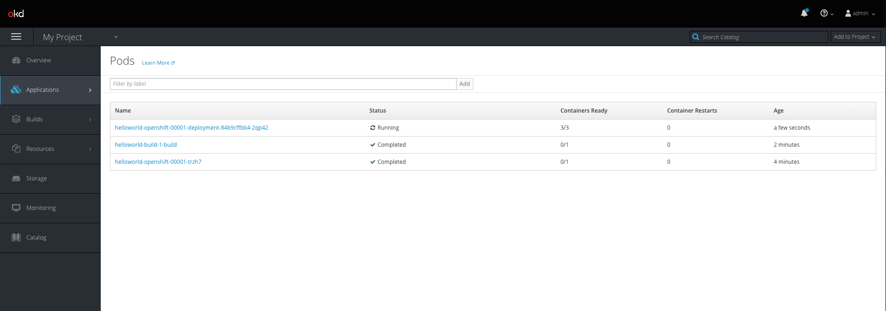
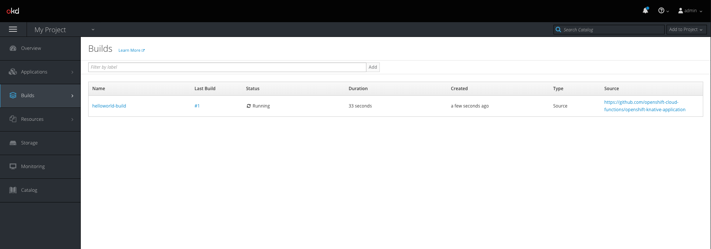
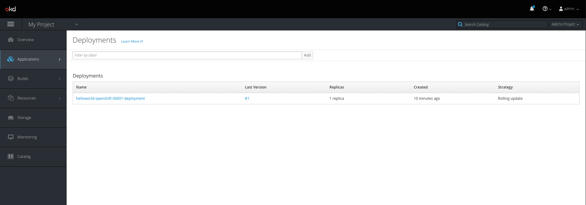
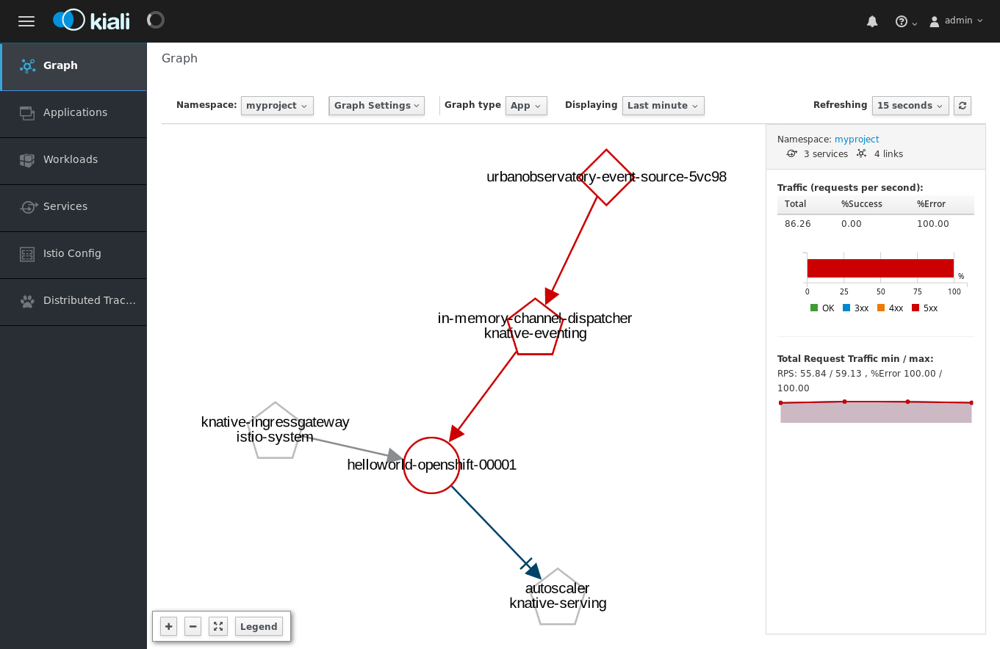
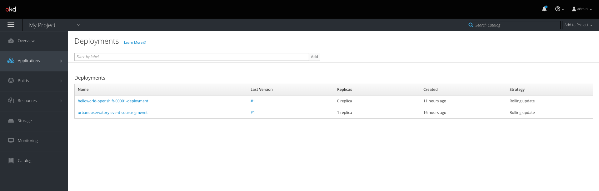

# Knative and OpenShift Demo for KubeCon

This is a Knative on OpenShift demo as given at KubeCon. It walks you through on what Knative has to
offer:

1. It builds an application through Knative's Build component (which makes use of the existing OpenShift
Build mechanic underneath).
2. The built image is then deployed as a Knative Service, which means it scales automatically, even down
to nothing as we'll see.
3. We wire an EventSource emitting IoT events from the Newcastle University to our application through 
Knative's Eventing capabilities.

## 0. Setting up an OpenShift cluster

Before we get started, let's setup an environment. This setup guide assumes the usage of `minishift` and the
setup scripts are tailored to facilitate that. To setup a fresh minishift cluster with OLM, Istio and all parts
we need from Knative installed, run the following script:

```bash
git clone git@github.com:openshift-cloud-functions/knative-operators.git
./knative-operators/etc/scripts/install.sh
```

> This script is destructive towards the 'knative' profile in minishift.

After this script exits without any errors, your cluster will be setup and ready to go. Next, let's make `oc`
(OpenShift's CLI) available in the current terminal and set the namespace to `myproject`:

```bash
eval $(minishift oc-env)
oc project myproject
```

There we are, let's get crackin'.

### Setting up access rights

To be able to access everything we need for the demo, we'll need to add certain rights to the `default` ServiceAccount
in our namespace. For the Build part it needs CRUD access to all OpenShift Build related entities (Build, BuildConfig,
ImageStream).

To set those up, run:

```bash
oc apply -f build/000-rolebinding.yaml
```

## 1. The Build component

The Build component in Knative is not so much a utility to build images themselves. It rather provides primitives,
to be able to string together the tools you want to do your image build. In a sense, it's an abstraction layer above
all the tools out there to build an image. In our case, the most prominent example is OpenShift's own build capability,
so this will show you, how we can implement a Knative Build by the means of an OpenShift Build.

Knative provides a mechanism called **BuildTemplates**, where you define a blueprint for a build, which contains the
arguments that that build might need to do its job of building the image in the end. An example of such a template can
be seen below. This template allows building images through Knative Build based on OpenShift's Build capability, so you
can use the tools you're used to while taking full advantage of Knative Build on top of it.

```yaml
apiVersion: build.knative.dev/v1alpha1
kind: BuildTemplate
metadata:
  name: openshift-builds
spec:
  parameters:
  - name: IMAGE
    description: The name of the image to push
  - name: NAME
    description: Build configuration name
  - name: IMAGE_STREAM
    description: The image stream to use as input for the build
  - name: TO_DOCKER
    description: Push the image to a Docker repository or not (true by default)
    default: "false"
  - name: DIRECTORY
    description: The directory containing the app
    default: /workspace
  - name: OC_BUILDER_IMAGE
    description: The name of the builder image to use
    default: docker.io/vdemeester/kobw-builder:0.1.0
  steps:
  - name: kobw-create-or-update
    image: "${OC_BUILDER_IMAGE}"
    args: ["create", "--name=${NAME}", "--image=${IMAGE}", "--image-stream=${IMAGE_STREAM}", "--to-docker=${TO_DOCKER}", "."]
    workingDir: "${DIRECTORY}"
    env:
      - name: NAMESPACE
        valueFrom:
          fieldRef:
            fieldPath: metadata.namespace
  - name: kobw-run
    image: "${OC_BUILDER_IMAGE}"
    args: ["run", "--name=${NAME}"]
    env:
      - name: NAMESPACE
        valueFrom:
          fieldRef:
            fieldPath: metadata.namespace
```

To achieve the desired effect, this template wraps an OpenShift Build entity to perform the build of the desired application.
To "install" that template, we need to `oc apply` it by:

```bash
oc apply -f build/010-build-template.yaml
```

This on its own will do nothing. It only defines a template for a build to reference. A **Build**, as seen below, then includes
such a references and provides it with the arguments needed to perform the build.

```yaml
apiVersion: build.knative.dev/v1alpha1
kind: Build
metadata:
  name: oc-build-1
spec:
  source:
    git:
      url: https://github.com/openshift-cloud-functions/openshift-knative-application
      revision: master
  template:
    name: openshift-builds
    arguments:
    - name: IMAGE_STREAM
      value: golang:1.11
    - name: IMAGE
      value: "helloworld:latest"
    - name: NAME
      value: helloworld-build
```

In this particular case, the source code is taken from a git repository's master branch. The arguments to the template then define
that we want to build a Golang based application and want to name the image `helloworld:latest`.

Now we could go ahead and run this build on its own by applying it like the template above and using
`oc apply -f build/020-build.yaml`, but it's much more interesting to see how it's stringed together
with creating a deployment in the same step. After all, an image on it's own is worth nothing if its
not deployed.

## 2. The Serving component

The Serving component revolves around the concept of a **Service** (for clarity, it's called **KService**
throughout, because that term is vastly overloaded in the Kubernetes space). A KService is a higher level
construct that describes how an application is built and then how it's deployed in Knative.

A KService definition looks like this:

```yaml
apiVersion: serving.knative.dev/v1alpha1
kind: Service
metadata:
  name: helloworld-openshift
  namespace: myproject
spec:
  runLatest:
    configuration:
      build:
        source:
          git:
            url: https://github.com/openshift-cloud-functions/openshift-knative-application
            revision: master
        template:
          name: openshift-builds
          arguments:
          - name: IMAGE_STREAM
            value: golang:1.11
          - name: IMAGE
            value: "helloworld:latest"
          - name: NAME
            value: helloworld-build
      revisionTemplate:
        metadata:
          annotations:
            alpha.image.policy.openshift.io/resolve-names: "*"
        spec:
          containerConcurrency: 3
          container:
            imagePullPolicy: Always
            image: docker-registry.default.svc:5000/myproject/helloworld:latest
```

It's very apparent that the `spec.runLatest.configuration.build` part is a one-to-one copy of the Build
manifest we created above. If we apply this specification, Knative will go ahead and build the image
through the capabilities described above. Once that's done it'll go ahead and deploy a **Revision**,
an immutable snapshot of an application. Think of it as the **Configuration** of the application at a
specific point in time.

The `revisionTemplate` part of the KService specification describes how the Pods that will contain the
application will be created and deployed. In this case, it's going to pull the image that's built
from the OpenShift internal registry.

We create the KService by, you guessed it, applying the file through `oc`:

```bash
oc apply -f serving/010-service.yaml
```

Now the build will eventually start running. You can see through the OpenShift console, how a job is created
that orchestrates the build.

```bash
# Open in your browser (default credentials: admin/admin)
echo "https://$(minishift ip):8443/console/project/myproject/browse/pods"
```



Eventually, an OpenShift Build is created and builds the image, as can be seen
on the Builds page.

```bash
# Open in your browser (default credentials: admin/admin)
echo "https://$(minishift ip):8443/console/project/myproject/browse/builds"
```



Once the build finishes Knative will produce a plain Kubernetes deployment that contains the container we specified 
in the RevisionSpec above.

```bash
# Open in your browser (default credentials: admin/admin)
echo "https://$(minishift ip):8443/console/project/myproject/browse/deployments"
```



Now, to see that the service is actually running, we're going to send a request against it. To do so,
we'll get the domain of the KService:

```bash
$ oc get kservice
NAME                   DOMAIN                                       LATESTCREATED                LATESTREADY                  READY     REASON
helloworld-openshift   helloworld-openshift.myproject.example.com   helloworld-openshift-00001   helloworld-openshift-00001   True
```

The *DOMAIN* part is what we're interested in. The actual request is then sent to the entrypoint of our
servicemesh, which is listening on `$(minishift ip):32380`). Stringed together we get the following
command:

```bash
$ curl -H "Host: helloworld-openshift.myproject.example.com" "http://$(minishift ip):32380/health"

                    888 888             888
                    888 888             888
                    888 888             888
888d888 .d88b.  .d88888 88888b.  8888b. 888888
888P"  d8P  Y8bd88" 888 888 "88b    "88b888
888    88888888888  888 888  888.d888888888
888    Y8b.    Y88b 888 888  888888  888Y88b.
888     "Y8888  "Y88888 888  888"Y888888 "Y888
```

It's alive!

## 3. The Eventing component

The previous steps showed you how to invoke a KService from an HTTP request, in that case submitted via curl.
Knative Eventing is all about how you can invoke those applications in response to other events such as those received from message brokers or external applications.
In this part of the demo we are going to show how you can receive Kubernetes platform events and route those to a Knative Serving application.

Knative Eventing is built on top of three primitives:
* Event Sources
* Channels
* Subscriptions

**Event Sources** are the components that receive the external events and forward them onto **Sinks** which can be a **Channel**.
Out of the box we have Channels that are backed by Apache Kafka, GCPPubSub and a simple in-memory channel.
**Subscriptions** are used to connect Knative Serving application to a Channel so that it can respond to the events that the channel emits.

Let's take a look at some of those resources in more detail.

We have some yaml files prepared which describe the various resources, firstly the channel.

```yaml
apiVersion: eventing.knative.dev/v1alpha1
kind: Channel
metadata:
  name: testchannel
spec:
  provisioner:
    apiVersion: eventing.knative.dev/v1alpha1
    kind: ClusterChannelProvisioner
    name: in-memory-channel
```
Here we can see that we've got a channel named `testchannel` and it is an `in-memory-channel` which is what we're going to use for this demo - in production we would probably use Apache Kafka.
Let's deploy that so that we can use it in a later stage.

```bash
oc apply -f eventing/010-channel.yaml
```

Next let's take a look at the EventSource.

```yaml
apiVersion: sources.eventing.knative.dev/v1alpha1
kind: ContainerSource
metadata:
  name: urbanobservatory-event-source
spec:
  image: docker.io/markusthoemmes/knative-websocket-eventsource
  args: 
    - '--source=wss://api.usb.urbanobservatory.ac.uk/stream'
  sink:
    apiVersion: eventing.knative.dev/v1alpha1
    kind: Channel
    name: testchannel
```

This is starting to get a little bit more interesting. This EventSource is a so called `ContainerSource`. As such, it runs a container
based off the image given and instructs it to send its event to the sink described in the YAML. In this case, this container happens
to be a Websocket connector and we want all events coming from the specified Websocket server to be forwarded to the given sink. That
sink is the channel that we created before in this case.

This source in particular will emit IoT events from the buildings of the University of Newcastle, how cool is that? We'll allow it to
actually reach the defined host by setting up matching egress policies:

```bash
oc apply -f eventing/020-egress.yaml
```

If we now apply our source YAML, we will see a pod created which is an instance of the source we defined above.

```bash
oc apply -f eventing/021-source.yaml
```

```bash
# Open in your browser (default credentials: admin/admin)
echo "https://$(minishift ip):8443/console/project/myproject/browse/deployments"
```


The EventSource is up and running and the final piece of the Knative Eventing is how we wire everything together.
This is done via a Subscription.

```yaml
apiVersion: eventing.knative.dev/v1alpha1
kind: Subscription
metadata:
  name: testevents-subscription
  namespace: myproject
spec:
  channel:
    apiVersion: eventing.knative.dev/v1alpha1
    kind: Channel
    name: testchannel
  subscriber:
    ref:
      apiVersion: serving.knative.dev/v1alpha1
      kind: Service
      name: helloworld-openshift
```

This Subscription again references the `testchannel` and also defines a `Subscriber`, in this case the Serving application `helloworld-openshift` we built earlier.
This basically means that we have subscribed the previously built application to the `testchannel`.
Once we apply the `Subscription` any Kubernetes platform events from the `myproject` namespace will be routed to the `helloworld-openshift` application.
Behind the scenes there is a `SubscriptionController` which is doing the wiring for us.

```bash
oc apply -f eventing/030-subscription.yaml
```

And by that, events coming through our source are now dispatched via a channel to the service that we created in the beginning of this tutorial. We can actually see
the events by having a look at the logs of our application.

```bash
oc logs helloworld-openshift-00001-deployment-5f8dbfb49c-txg8j -c user-container
```

We can also visualize what's exactly happening using Kiali.

```bash
# Open in your browser (default credentials: admin/admin)
echo "https://$(oc get routes kiali -n istio-system -o jsonpath='{.spec.host}')/console/service-graph/myproject?layout=cose-bilkent&duration=60&edges=requestsPercentOfTotal&graphType=app"
```



The graph visualizes how the app we've deployed, which is represented by the deployment *helloworld-openshift-00001* in this screenshot,
is connected with various components of Knative. Events can flow in either via the *knative-ingressgateway* (essentially: from anywhere)
and the *in-memory-channel-dispatcher*, which we've deployed earlier to be able to receive events. That channel gets its events via
the *testevents* pod we've created earlier, which is the Source listening on Kubernetes Events.

We can also roughly spot how the Knative Serving system works underneath, as our deployment gets requests from the activator and is connected
to the autoscaler, to provide metrics there.

## 4. Scaling up and down

Since the buildings of the University of Newcastle are generating a vast and steady stream of information, Knative will actually scale the application that we've deployed
to fit the incoming volume dynamically. We should meanwhile have a couple of pods around.

```bash
# Open in your browser (default credentials: admin/admin)
echo "https://$(minishift ip):8443/console/project/myproject/browse/deployments"
```


Now, the serverless promise is to alyway only need what is necessary to serve the traffic to our application. That means, if there is no traffic our application should
have zero pods. We can simulate that by removing the subscription of the channel to our application:

```bash
oc delete -f eventing/030-subscription.yaml
```

Now we wait a couple of minutes and we'll see the pods slowly disappearing until they even disappear completely. Reinstanatiating the subscription as shown above
will bring them back in numbers to serve the traffic of course.

```bash
# Open in your browser (default credentials: admin/admin)
echo "https://$(minishift ip):8443/console/project/myproject/browse/deployments"
```




## Conclusion

With that we've successfully touched many aspects of what Knative has to offer today. We've built a Knative application
from scratch, making use of OpenShifts existing rich Build support. We've further seen how to hook that application up with
an arbitrary event source, to feed that data to our application in a declarative fashion. Lastly, we've seen how Knative
scaled our application according to the needs of incoming traffic and even scaled the application down to zero instances,
when no traffic was coming in at all.